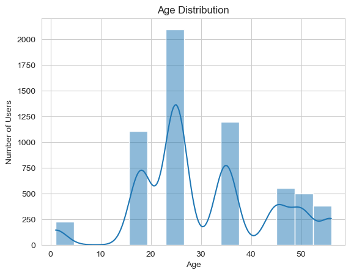
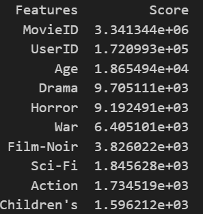

# Movie_Analysis Project

## Problem Objective / Statement:
The primary objective is to conduct in-depth exploratory data analysis (EDA) and feature engineering to uncover insights into movie ratings. By leveraging feature engineering techniques, I aim to identify key features that influence the ratings of the movies.

## Analysis Tasks:

### 1. Create Master Dataset
Create a new dataset named Master_Data, which includes the following columns: MovieID, Title, UserID, Age, Gender, Occupation, and Rating. This consolidated dataset will facilitate comprehensive analysis.

### 2. Insights based on Exploratory Data Analysis (EDA) not limited to below areas:
- **User Age Distribution**: Range of age 25 to 34 has the highest age distribution.
    
    
- **User Rating of "Toy Story"**: Most of the user rating falls within 4 and 5, and the average rating is 4.15.
- **Top 25 Movies by Viewership Rating**: 
    
- **Ratings for Movies Reviewed by a Specific User**: We shall used user ID of 2796 for our analysis and refer to the juypter notebook for the analysis.
- **Top three occupation / group**: 
    1) College / grad student
    2) Others
    3) Executive / managerial

### 3. Feature Engineering
- **Unique Genres**: A total of 18 unique genres.
- **One-Hot Encoding**: Create a separate column for each genre category with one-hot encoding (1 and 0) to indicate whether or not the movie belongs to that genre.
- **Feature selection**: I have used the chi-squared statistical method to identify the top 10 features.
    

## 4. Overview of the folder structure
```
├── Data
│   └── movies.dat
│   └── ratings.dat
│   └── users.dat
├── README.md
├── EDA.ipynb
```

